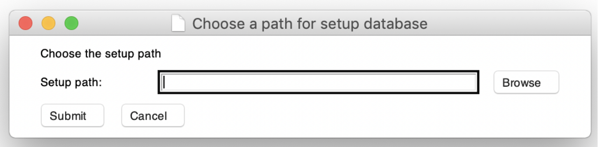

# jaqk.setup()

**THIS IS THE 1st THING TO DO BEFORE ANY OTHER STEPS.**

**setup** the database by choosing a path for the local database. Then it creates necessary files in the database, 
and all later data downloaded **will be stored in this path**. The size of all data is **around 100MB**.


#### See also: 
[jaqk.main()](../data-collection/jaqk.main.md) : stock data crawler.

[installation](./installation.md) : installation of JAQK.

[jaqk.test()](./jaqk.test.md) : test key functionality of the module.

#### Examples
After installation of JAQK, setup is the necessary first step.
```python
>>> import jaqk
>>> jaqk.setup()
```
Then a GUI for choosing the path of database pops out, where you need to choose a folder in your PC.



Click `Browse`, then choose a folder you like, then click `Submit`. 
```python
>>> import jaqk
>>> jaqk.setup()
Database has been setup on path: /../../../
```

**setup() is only required on the first time using the package.**


#### Next step

Follow the [guidebook](guidebook.md) to complete the installation process.

----

###### Back to [index page](../index.md)