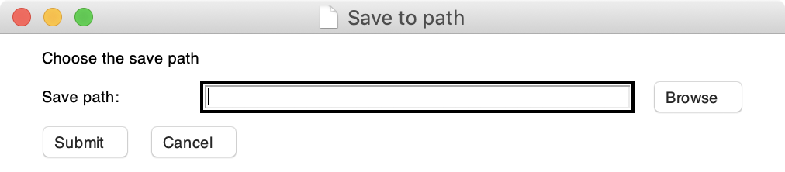

# jaqk.save()

jaqk.save(df, name: str, file_type: str = '.csv', mode: str = 'w', **save_kwargs)

Saves data sheet to a chosen or given location. A GUI is used to simplify the process, 
which can be silenced using `gui=False`.

### Parameters:

- **df** **:** **pandas DataFrame**
    
    A pandas DataFrame object. This is the sheet you want to save. 
    The DataFrame object is saved using `df.to_csv()`.
    
- **name** **:** **str**
    
    Name of the file. The final path follows: ./name.file_type.

- **file_type** **:** **str, default '.csv'**

    File postfix for dataframe. In most cases '.csv' works fine. 
    If you want to save text file with this, set `file_type='.txt'`.

- **mode** **:** **str, default 'w'**

    Mode of saving. Used for `df.to_csv(path, mdoe=mode)`. 
    
    - **w** **:** **write (overwrite)** the dataframe. Create csv file if not exist. 
    - **a** **:** **append** dataframe to the end of the original DF. Create csv file if not exist.
    
    You can search for more saving mode on [Python documentation](https://docs.python.org/3/tutorial/inputoutput.html#reading-and-writing-files). 

- **save_kwargs** **:**
    - **gui** **:** **bool, default True**
    
        A GUI for choosing path pops out if **`gui=True`**. If set **`gui=False`**,
        you must provide **`path`**.
        
    - **path** **:** **str, default None**
    
        When **`gui=False`**, **`path`** must be provided. `path` should a absolute path of a folder. 
        (You can use [jaqk.datapath()](./jaqk.datapath.md) to find abs path.)
        
    - **prt** **:** **bool, default True**
        
        Print the status of saving when **`prt=True`**. save() won't print anything if **`prt=False`**.
        
    - **test** **:** **bool, default False**
    
        Used for internal testing. save() will save the file to /jaqk/database/test when **`test=True`**.
        Recommended to set **`test=False`**.
    


#### See also

[jaqk.datapath()](./jaqk.datapath.md) : get abs path of a file easily.

[jaqk.get_sheet()]() : method for getting sheet of data from database.


#### Example

Save a df to a directory using GUI:
```python
>>> import jaqk
>>> df = jaqk.get_sheet('AAPL', 'income')['AAPL']['income']
>>> jaqk.save(df, 'AAPL_income')
```
Then, a GUI for choosing directory would pop out:


Click **`Browse`** to select a path, then click **`Submit`**. The file is saved to your chosen path.

----

Save a df to a directory without GUI:
```python
>>> import jaqk
>>> df = jaqk.get_sheet('AAPL', 'income')['AAPL']['income']
>>> jaqk.save(df, 'AAPL_income', gui=False, path='./data_sheet.csv')
```
GUI won't pop out now. Note that if you do not give **`path`**, an save() will raise a **`ValueError`**. 

----

###### Back to [index page](../index.md)